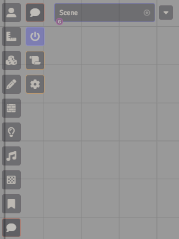
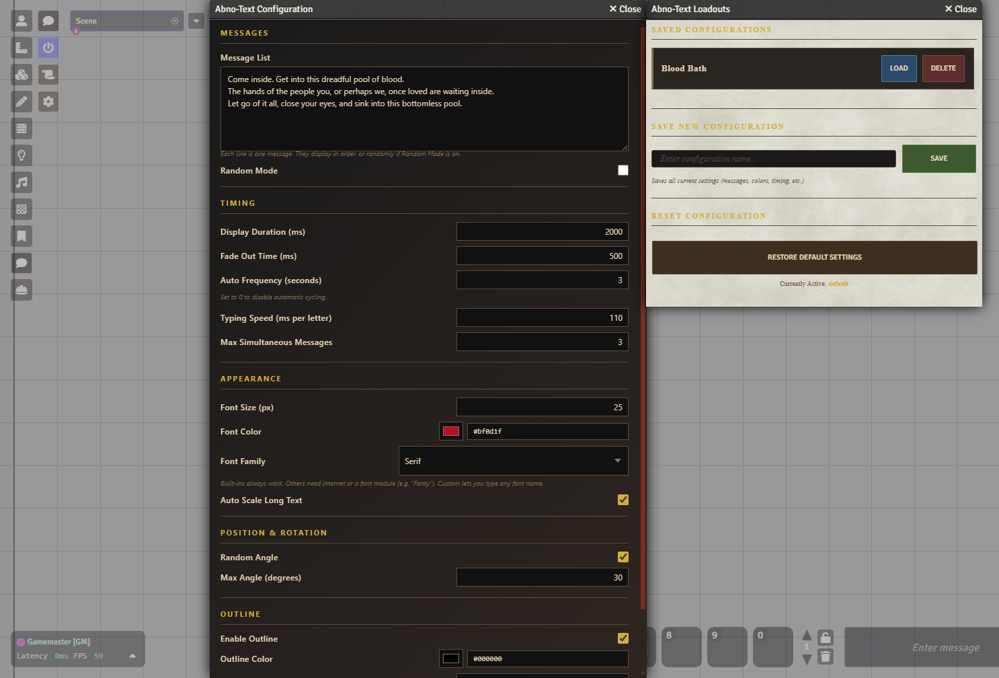

# Abno Text

**Manifest URL:** `https://raw.githubusercontent.com/VaniFoundry/abno-text/main/module.json`

**Designed with [Stars of the City](https://github.com/tsu-b-asa/sotc) in mind** - a Project Moon inspired TTRPG by Jakkafang & community.

A Foundry VTT module that displays styled text on screen during play, mimicking the abnormality fight text, and maybe songs, from PM games.

## Features

- **On-Screen Text Display**: Shows messages directly on the screen with a typing animation effect

    > Note: All visual options can be adjusted in the Configuration menu

- **Automatic Sequencing**: Cycles through your message list in order, or randomly if preferred
- **Auto-Scale**: Long messages automatically shrink to fit the screen
    > Note: Bugs a little with really big text
- **Multiplayer Sync**: Messages are broadcast from the GM to all connected clients
- **Controls Menu**: Activate/Deactivate, Loadout System and Configuration Menu all accessible through the controls pannel.

<table>
  <tr>
    <td align="center"></td>
    <td align="center"></td>
  </tr>
</table>

## How It Works

The GM configures a list of messages and a display frequency. When active, the module cycles through them automatically at the set interval, showing each message on screen for all players with a typing effect and fade-out.

### Configuration & Loadouts

Open the **Configuration** panel from the scene controls to set messages, timing, colors, and font options. Use the **Loadouts** panel to save and swap between different presets — useful for having different message sets per encounter or enemy.

### Controls

The module adds a control group to the scene toolbar (GM only):

- **Toggle**: Enable or disable automatic message display
- **Loadouts**: Open the loadout manager to save/load presets
- **Config**: Open the configuration panel

## Installation

1. Place the module folder in your Foundry `Data/modules` directory
2. Enable the module in Foundry's module management screen
3. Open the **Config** panel from the scene toolbar and change the default values as you wish; you can keep saving loadouts to use any time

Or install directly via Foundry using the [manifest URL](https://raw.githubusercontent.com/VaniFoundry/abno-text/main/module.json).

## Compatibility

| Foundry Version | Status |
|---|---|
| v13 | ✅ Verified |
| v11 | ✅ Supported |

## Changelog

NOTE: Will be edited after v1.1.0 for major changes or updates